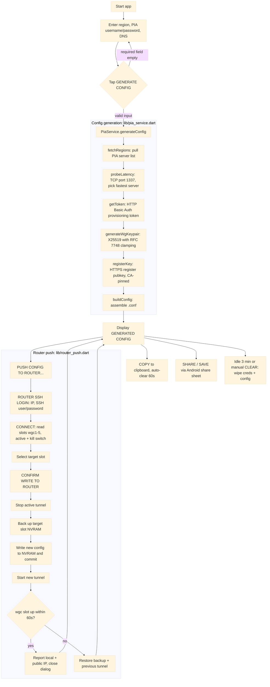

# How it works

The provisioning logic in `lib/pia_service.dart` is a direct Dart translation of the command line version's [Go code](https://github.com/ExponentiallyDigital/pia-wireguard-cfg/blob/main/main.go), implementing the same steps in the same order:

1. **Server discovery**: pulls the complete endpoints mapping directly from serverlist.piaservers.net/vpninfo/servers/v6. The payload splits at the first newline boundary to discard the payload block signature.
2. **Latency probes**: dispatches immediate TCP probes to port 1337 across regional candidate blocks to calculate routing latency.
3. **Session tokens**: challenges the central API through a standard POST request over TLS, securing an execution token from basic user parameters.
4. **Keypair issuance**: generate WireGuard keypair using X25519 with RFC 7748 scalar clamping  
   (k[0] &= 248, k[31] &= 127, k[31] |= 64)
5. **Secure registration**: submits the dynamic public key configuration to the chosen low-latency endpoint via an HTTPS API (port 1337). The step utilises the dynamically resolved PIA root certificate, matching the specific Common Name (CN) mapping fields rather than raw IP routing addresses. The certificate is not hardcoded, so that it stays current when PIA rotates it.
6. **Config assembly**: transforms payload metadata returns into localised .conf specifications utilising Unix line endings (\n) for cross-compatibility.

## App processing flow



---

### Sample `pia-wireguard-cfga` output

```none
[Interface]
PrivateKey = <freshly generated private key>
Address    = <client IP/32 assigned by PIA>
DNS        = 9.9.9.9, 149.112.112.112
MTU        = 1420

[Peer]
PublicKey           = <server public key from PIA>
Endpoint            = <server IP:port from PIA>
PersistentKeepalive = 25
AllowedIPs          = 0.0.0.0/0
```

---

## Network traffic

Below are detailed representations of the app's network calls, with illustrative, not real, IP addresses.

.svg>)

.svg>)

---

## Output & session destruction

Generated configuration data is managed via:

- **Ephemeral verification:** displayed on-screen inside a text viewport for visual validation.
- **Transient streaming:** shareable using Android's system share sheet (e.g., via "Save to Files" or encrypted side-channels).
- **Manual clear:** the **CLEAR CREDS & CFG** button scrubs the username, password, and on-screen displayed config.
- **Clipboard sanitisation:** tapping **COPY** invokes a 60-second timer that clears the clipboard storage space automatically.
- **Safety timeout clock:** adjacent to the **CLEAR CREDS & CFG** action button, a real-time countdown widget tracks session idle state, wiping config, PIA credentials, and the **GENERATED CONFIG** if the application interface is untouched for 3 consecutive minutes.

---
