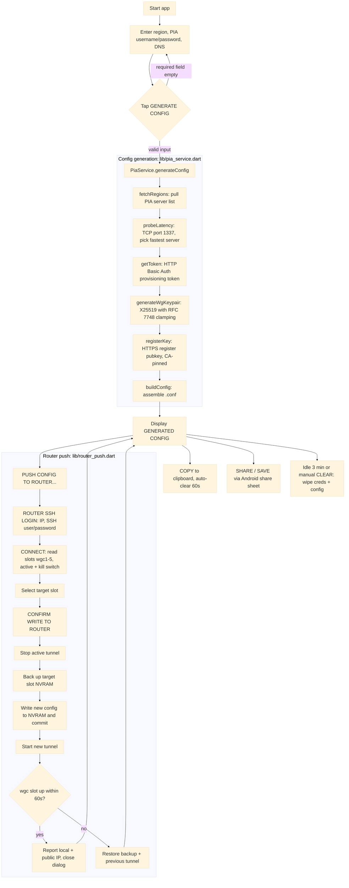

# pia-wireguard-cfga

<a href="https://www.android.com/" target="_blank" rel="noopener noreferrer"></a> <a href="https://github.com/ExponentiallyDigital/pia-wireguard-cfga/releases" target="_blank" rel="noopener noreferrer"></a> <a href="https://github.com/ExponentiallyDigital/pia-wireguard-cfga/tags" target="_blank" rel="noopener noreferrer"></a> <a href="https://github.com/ExponentiallyDigital/pia-wireguard-cfga/blob/main/LICENSE" target="_blank" rel="noopener noreferrer"></a> <a href="https://github.com/ExponentiallyDigital/pia-wireguard-cfga/releases" target="_blank" rel="noopener noreferrer"></a><br><a href="https://sonarcloud.io/project/overview?id=ExponentiallyDigital_pia-wireguard-cfga" target="_blank" rel="noopener noreferrer"></a> <a href="https://sonarcloud.io/project/overview?id=ExponentiallyDigital_pia-wireguard-cfga" target="_blank" rel="noopener noreferrer"></a> <a href="https://sonarcloud.io/project/overview?id=ExponentiallyDigital_pia-wireguard-cfga" target="_blank" rel="noopener noreferrer"></a> <a href="https://github.com/ExponentiallyDigital/pia-wireguard-cfga/blob/main/SECURITY.md" target="_blank" rel="noopener noreferrer"></a><br><a href="https://sonarcloud.io/project/overview?id=ExponentiallyDigital_pia-wireguard-cfga" target="_blank" rel="noopener noreferrer"></a> <a href="https://sonarcloud.io/project/overview?id=ExponentiallyDigital_pia-wireguard-cfga" target="_blank" rel="noopener noreferrer"></a> <a href="https://sonarcloud.io/project/overview?id=ExponentiallyDigital_pia-wireguard-cfga" target="_blank" rel="noopener noreferrer"></a>

A native Android GUI app built with Flutter and Dart that generates a ready-to-use WireGuard configuration file for the Private Internet Access (PIA) VPN service. It authenticates with PIA's official provisioning API, selects the lowest-latency server in your chosen region, generates a fresh WireGuard keypair, and allows you to save the complete `.conf` to the clipboard or share/save to a user specified app/location. If you have an ASUS router running [Asuswrt-Merlin](https://www.asuswrt-merlin.net/) firmware, you can optionally "push" the new config directly to your router!

This app is a GUI Android APK equivalent of my [Windows 11/Linux command line app](https://github.com/ExponentiallyDigital/pia-wireguard-cfg).

## Why use this?

Manually creating a PIA WireGuard configuration requires authenticating against multiple APIs, parsing server lists, performing key exchange, and assembling the config by hand. **pia-wireguard-cfga** automates the entire process.

## Features

- **Automated lowest-latency server selection:** measures live TCP latency against port 1337 across all available servers in your selected target region, ensuring that you provision with the fastest node.
- **Cryptographically secure keypair generation:** dynamically generates an ephemeral WireGuard keypair using `x25519` with proper RFC 7748 scalar clamping directly inside the runtime environment.
- **Dynamic certificate pinning:** fetches PIA's trusted root CA certificate dynamically at runtime from the `pia-foss/manual-connections` repository. No hardcoded certificates ensure operations continue smoothly even if PIA rotates authority roots.
- **Zero-persistence local footprint:** sensitive keys, usernames, and passwords reside exclusively as short-lived volatile variables inside system RAM (`AppState`). Config payloads are written to a named temporary file solely to preserve the correct filename through the OS share pipeline, then deleted immediately in a `finally` block once `share()` returns -- whether the share completes, is cancelled, or throws. No unencrypted files are permanently cached or retained in local storage.
- **Credential safety:** your PIA password is entered interactively at execution and used strictly to request a short-lived HTTP Basic Auth provisioning token. Credentials are never written to disk, stored, or logged.
- **Automatic session wipe:** includes an automatic 3-minute safety countdown timer. If the app is left idle for 3 continuous minutes while displaying a configuration, the screen UI, form states, and memory addresses are wiped. Active screen interactions reset the timer to 3 minutes.
- **Automated clipboard protection:** copies the generated config securely to the clipboard and triggers an independent 60-second real-time countdown visible under the button. After 60 seconds, or immediately if the user triggers a manual session wipe, the system clipboard is overwritten with an empty string to prevent background clipboard-scraping apps from harvesting your config.
- **Native task-switcher protection (`FLAG_SECURE`):** enforces native OS-level window flags to block third-party screenshot capturing and automatically obfuscates/blanks the app layout view inside the Android Recent Apps / Task Switcher interface.
- **Input field hardening:** user credential entry textboxes disable predictive dictionary caching, auto-correction tracking assistance, and keyboard learning behaviours, alongside native selection overrides to block background clipboard scraping.
- **Modern adaptive styling:** fully supports Android 8.0+ Adaptive Icons using a native multi-layered presentation conforming to a dark-mode theme aesthetic (`#12141A`).

---

## Pre-built releases

This app has been submitted to the Google Play Store, when their process concludes, a link will be placed **`<here>`**.

If you want to download a pre-built release from [GitHub](https://github.com/ExponentiallyDigital/pia-wireguard-cfga/releases), the file you need is **`pia_wireguard_cfga-<version>_release.apk`**.

Each release includes the following versioned files:

- **`pia_wireguard_cfga-<version>_release.apk`** – optimised signed release APK
- **`pia_wireguard_cfga-<version>_debug.apk`** – debug APK for testing
- **`pia_wireguard_cfga-<version>_google-play-store.aab`** – an Android App Bundle for the Play Store
- **`pia-wireguard-cfga-<version>_sbom.spdx.json`** – software bill of materials (SPDX format)
- **`README.html`** – offline documentation (generated from this README)
- **`LICENSE`** – license file

The installlable pre-built apps above have [GitHub Attestations](https://github.com/ExponentiallyDigital/pia-wireguard-cfga/attestations) for [build provenance](https://slsa.dev/spec/draft/build-provenance) verification.

---

## Using the app

1. Enter a region or tap the icon to the right and select from a dynamically updated alpha sorted filterable list of available PIA regions:

<table>
<tr>
<td align="center">
<br>
<strong>PIA WireGuard Config App UI</strong>
</td>
<td align="center">
<br>
<strong>Region Selection Screen</strong>
</td>
</tr>
</table>

2. Add/paste your PIA username/password details:

<p align="center">
  
</p>
<p align="center">
  <strong>Interface Fields</strong>
</p>

3. Optional - accept the default DNS servers (Quad 9: 9.9.9.9, 149.112.112.12) or enter your choice (e.g.,Cloudflare: 1.1.1.1, 1.0.0.1 ), use a comma to separate entries.

4. Tap the **GENERATE CONFIG** button.

5. After successful PIA authentication your chosen region's config file is displayed in the **GENERATED CONFIG** window. You can select specific text from this window or tap **COPY** to send the window contents to the clipboard (clipboard is cleared after 60 seconds).
   Use **SHARE / SAVE** to send the config file to a specific app e.g. your favourite file system app to save the generated conf file to a location of choice:

<table>
<tr>
<td align="center">
<br>
<strong>Generated config</strong>
</td>
<td align="center">
<br>
<strong>Share</strong>
</td>
</tr>
</table>

6. Conf files are named per the region name (agreed, PIA isn't consistent with the region name format!)
7. Above the **GENERATED CONFIG** window there's a **CLEAR CREDS & CFG** button that removes your WireGuard credentials (config data, PIA username/password) from your device's screen and securely overwrites these variables from system memory. Next to that there's a countdown timer. After no activity for 3 minutes, your credentials are automatically wiped. The timer is reset when there's in app activity (scrolling, tapping etc).
   If you use the **COPY** button, the clipboard is cleared after 60 seconds automatically regardless of activity.

<p align="center">
  
</p>
<p align="center">
  <strong>Automated clipboard clear</strong>
</p>

8. As above, at the bottom of the screen there's a scrollable "LOG" of processing/activity that can be cleared.

## Pushing the config to an ASUS router

Once a config has been generated, you can push it to an **ASUS router running [Asuswrt-Merlin](https://www.asuswrt-merlin.net/) firmware** over SSH without copying the `.conf` by hand!

1. Generate a config as described above
2. In the **GENERATED CONFIG** section tap **PUSH CONFIG TO ROUTER...**

<p align="center">
  
</p>
<p align="center">
  <strong>Router push dialog</strong>
</p>
   
3. On the **ROUTER SSH LOGIN** window, enter the router **IP**, **SSH username** and **SSH password**, then tap **CONNECT**. The app reads all five slots and flags the currently **ACTIVE** and **KILL SWITCH** slot.

<p align="center">
  
</p>
<p align="center">
  <strong>Router login</strong>
</p>

4. Select your target `wgc1`–`wgc5` slot, existing slot descriptions are shown so you can avoid overwriting one you want to keep, then tap **CONFIRM WRITE TO ROUTER**.

<p align="center">
  
</p>
<p align="center">
  <strong>Write to router</strong>
</p>

5. Below in the **LOG** you'll see the app stopping the active tunnel, backing up the chosen slot, writing the new configuration to NVRAM, starting the new tunnel, then verifying that the `wgc<slot>` appears in `wg show interfaces` (retried for up to 60 seconds) and reports the assigned local and public IP addresses.

<p align="center">
  
</p>
<p align="center">
  <strong>Write to router</strong>
</p>

6. On success the dialog closes and the router is running your new tunnel. On failure the previous slot config and the previously active tunnel are restored automatically, check the **LOG** for details.

<p align="center">
  
</p>
<p align="center">
  <strong>Push complete</strong>
</p>

All app processing is reported live in the in-app **LOG** panel including SSH commands, active-interface detection, slot backup, the NVRAM write/commit, the start sequence, and the up-to-60-second verification, so you always know exactly what is happening and what was done. If any step fails, the app automatically restores both the target slot's previous contents and the previously active tunnel, and logs the recovery so the router isn't left in a broken state.

> [!TIP]
> Activity during the push to router continually resets the 3-minute idle timer, so a long verification will not trigger the automatic session wipe.

### Push to router prerequisites

- An ASUS router running **Asuswrt-Merlin** firmware with WireGuard **client** support (slots `wgc1`–`wgc5`).
- **SSH access enabled** on the router (Administration → System → enable the _SSH Daemon_; LAN-only is recommended) and reachable from your device.
- The router's **LAN IP**, plus an **SSH username** and **password** (defaults to `192.168.0.254` / `admin`).
- A config already generated in the app, the **PUSH CONFIG TO ROUTER...** button only appears once a config is generated.

## Notes

- **Time-to-live constraints**: PIA WireGuard configs expire every few weeks per PIA's token handling, requiring you to regenerate a config file periodically (which is why this app exists!).
- **Key safety**: the generated config contains private encryption keys. Treat them like a password and manage them securely.
  > [!IMPORTANT]
  >
  > **Push to router**: the app assumes that <font color="red"><b>only one WireGuard VPN is active at any time</b></font>, when you save the config to your router that "slot" will become the active VPN replacing any previously active slot and any slot with a <font color="red"><b>kill switch</b></font> will be deactivated and the kill switch together with NAT and firewalling will be applied to the newly saved slot.

---

## App processing flow



---

## Security

We take credential safety and application hardening seriously. Please see our [SECURITY.md](./SECURITY.md) for details on our secure development practices, data handling lifecycle, and instructions on how to privately report potential vulnerabilities.

---

## Build setup

The script `build.ps1` in the repo root folder automates a local build or if you prefer to compile and test the application locally, follow the below steps.

### Prerequisites

- **Flutter SDK:** version 3.10 or later ([Flutter installation guide](https://flutter.dev/docs/get-started/install))
- **Android SDK / Studio:** [download Android Studio](https://developer.android.com/studio) and configure with Java Development Kit (JDK 17), also install Android SDK Command-line Tools and check your config with `flutter doctor`
- A connected physical Android device (with USB Debugging enabled) or an active Android Virtual Device (AVD) Emulator.

### Building

### 1. Clean and install dependencies

Clean the build environment and pull the tracking package constraints defined within the project manifests:

```bash
flutter clean
flutter pub get
```

### 2. Generate assets (launcher icons)

The app leverages the `flutter_launcher_icons` framework to generate adaptive foreground and background configurations for Android launchers. Before your initial compilation, generate the native resource files:

```bash
dart run flutter_launcher_icons
```

### 3. Test and run

Execute tests and run a hot-reloaded debug instance directly onto your attached mobile/emulated device:

```bash
flutter test --coverage
flutter run
```

### 4. App signing & keystore configuration

To ensure that both local release builds and GitHub Actions CI builds produce matching digital signatures, this project uses a unified keystore strategy. This allows Android devices to accept over-the-top APK installations (sideloading updates) without requiring a manual uninstall first.

> [!CAUTION]
> Android strictly enforces that every APK update must be signed by the exact same certificate as the installed version. Mixing a debug-signed local APK with a release-signed CI APK (or vice versa) results in an `INSTALL_FAILED_UPDATE_INCOMPATIBLE` rejection.

#### Local developer set up (One-time)

1. **Generate the keystore:** execute the following command to generate a 2048-bit RSA key pair valid for 10,000 days:

   ```bash
   keytool -genkey -v -keystore release.jks -alias pia-wireguard \
       -keyalg RSA -keysize 2048 -validity 10000
   ```

2. Secure the keystore file: move release.jks completely OUTSIDE of the repository folder (e.g., place it securely in your user home directory: ~/.android/). Never commit a .jks file to source control.

3. Configure local environment credentials: create a local configuration file named android/key.properties (this file is already safely ignored by .gitignore) and provide the exact absolute path and passwords:

   ```ini
   storeFile=/Users/YOUR_USERNAME/.android/release.jks
   storePassword=YOUR_STORE_PASSWORD
   keyAlias=pia-wireguard
   keyPassword=YOUR_KEY_PASSWORD
   ```

#### CI/CD environment setup (GitHub Actions)

The `release.yml` workflow is designed to dynamically assemble this footprint before compilation so developers and automation stay perfectly in sync:

1. **Base64 encode the keystore**: to inject the binary keystore into GitHub without committing it, encode it to a clean text blob and copy it to your clipboard:
   - **macOS**: `base64 -i release.jks | pbcopy`
   - **Linux**: `base64 -w 0 release.jks`
   - **Windows (PowerShell)**: `[Convert]::ToBase64String([IO.File]::ReadAllBytes("release.jks")) | Set-Clipboard`

2. Add repository secrets: in your GitHub Repository, navigate to Settings > Secrets and variables > Actions and create four secrets using the values you created above:
   - KEYSTORE_BASE64 (The string blob copied from the base64 command)
   - KEYSTORE_PASSWORD
   - KEY_ALIAS
   - KEY_PASSWORD

The pipeline will decode the base64 asset and provision a temporary `key.properties` dynamically before executing `flutter build apk --release`.

### 5. Build release APK

Once your local `android/key.properties` or GitHub Repository Secrets are mapped out (see header comments in `android\app\build.gradle.kts`), create a stand-alone production compilation targeted for distribution:

```bash
flutter build apk --release
```

#### Local output destinations

- Standard Flutter pipeline archive: build/app/outputs/flutter-apk/app-release.apk
- Gradle pipeline build output: build/app/outputs/apk/release/pia-wireguard-cfga-release.apk

### 6. Sideload

To push the compiled binaries directly onto your phone via Android Debug Bridge (ADB):

```bash
adb install build/app/outputs/flutter-apk/app-release.apk
```

## Package dependencies

| Package             | Purpose                                                                             |
| ------------------- | ----------------------------------------------------------------------------------- |
| `http`              | HTTP REST connection pipelines to PIA APIs                                          |
| `x25519`            | Ephemeral WireGuard keypair generation                                              |
| `share_plus`        | Share/save config file via Android share sheet                                      |
| `package_info_plus` | Querying app package metadata dynamically from `pubspec.yaml` for version reporting |

## Dependency pinning & reproducible builds

Project and build-toolchain dependencies are strictly pinned to mitigate supply-chain vulnerabilities and ensure fully reproducible, deterministic builds across all local environments and CI/CD pipelines.

In `android\app\build.gradle.kts` we utilise Gradle's dependency locking feature enforced in **Strict Mode** (`LockMode.STRICT`). This guarantees that dynamic versions or changing dependencies cannot secretly pull in untested, unreviewed, or malicious updates. The build environment remains identical for every developer, every time.

### Why this matters

- **Supply-chain security**: prevents "dependency confusion" or compromised upstream updates from automatically making their way into our builds.
- **Consistency**: eliminates the infamous "it works on my machine" dilemma by freezing the entire dependency graph—including transitive dependencies.
- **Auditability**: changes to dependencies appear clearly in pull request diffs, allowing reviewers to catch unintended upgrades.

### The strict mode safeguard

If a dependency version is changed or a new package is added _without_ updating the lockfiles, the local build and CI/CD pipeline will intentionally crash with an error resembling:

> `> Resolved dependency 'androidx.core:core-ktx:1.12.0' which is not configured in the lockfile.`

This is expected and correct behavior designed to block untracked dependency updates from making it into production.

### When to regenerate lockfiles

You must regenerate the Gradle lockfiles whenever you:

1. Add a new package or dependency to build.gradle.
2. Update the version of an existing package.
3. Modify or upgrade build plugins.

### How to regenerate lockfiles

From the project root folder, execute the appropriate command for your operating system to update the three lockfiles:

CMD/PS1

```DOS
.\android\gradlew -p android :dependencies :app:dependencies --write-locks
```

Linux

```bash
./android/gradlew -p android :dependencies :app:dependencies --write-locks
```

> [!NOTE]
> After running this command, make sure to commit the updated lockfiles (\*.lockfile) to Git along with your build.gradle changes. If the lockfiles are missing or out of sync, the CI/CD pipeline will fail the build.

## Updating GitHub action SHAs

The `update-shgas.ps1` script, located in the repository root, automates the process of hardening GitHub Actions by pinning them to secure commit SHAs.
The script queries the GitHub API for the latest release tags, resolves them to full SHAs across all `.github/workflows/*.yml` files, and rewrites the workflows in-place. Any previously pinned SHAs are automatically re-evaluated and updated if a newer version is available.

### Example transformation

Before:

```bash
     uses: google/osv-scanner-action/.github/workflows/osv-scanner-reusable.yml@v1.0.3
```

After:

```bash
     uses: google/osv-scanner-action/.github/workflows/osv-scanner-reusable.yml@9a498708959aeaef5ef730655706c5a1df1edbc2  # v2.3.8
```

### Why this is a best practice

Pinning workflows to a specific commit SHA, rather than a mutable version tag like v1 or latest, is a critical security practice recommended by GitHub for several reasons:

- Defends against supply chain attacks: Git tags are mutable. If a malicious actor compromises a third-party dependency repository, they can move an existing version tag (like v1.0.3) to point to malicious code. Commit SHAs are cryptographically immutable and cannot be spoofed.

- Ensures build reproducibility: pinning guarantees that the exact same code runs during every workflow execution, preventing unexpected breaking changes or hidden updates from disrupting your CI/CD pipeline.

- Maintains readability via automation: while SHAs are great for security, they are terrible for human readability. The script solves this by automatically appending a comment with the human-readable version tag (e.g., # v2.3.8), giving you the best of both worlds: strict security and clear version tracking.

## Build chain & utility notes

- keep your build environment up to date with:

  ```cmd
  flutter upgrade
  flutter pub upgrade
  .\android\gradlew -p android :dependencies :app:dependencies --write-locks
  ```

- To run **OSV-Scanner** locally (scans dependencies against Google's OSV vulnerability database):

  ```bash
  # 1. Download the latest Linux binary (run from repo root, e.g. under WSL)
  sudo curl -L https://github.com/google/osv-scanner/releases/latest/download/osv-scanner_linux_amd64 \
    -o /usr/local/bin/osv-scanner
  sudo chmod +x /usr/local/bin/osv-scanner

  # 2. Basic scan (recursively scans all supported lockfiles in the project)
  osv-scanner .

  # 3. Scan only the Dart/Flutter lockfile
  osv-scanner --lockfile=pubspec.lock

  # 4. Scan Android Gradle dependencies (expect many!)
  osv-scanner --lockfile=android/app/gradle.lockfile
  ```

---

## How it works

The provisioning logic in `lib/pia_service.dart` is a direct Dart translation of the command line version's [Go code](https://github.com/ExponentiallyDigital/pia-wireguard-cfg/blob/main/main.go), implementing the same steps in the same order:

1. **Server discovery**: pulls the complete endpoints mapping directly from serverlist.piaservers.net/vpninfo/servers/v6. The payload splits at the first newline boundary to discard the payload block signature.
2. **Latency probes**: dispatches immediate TCP probes to port 1337 across regional candidate blocks to calculate routing latency.
3. **Session tokens**: challenges the central API through a standard POST request over TLS, securing an execution token from basic user parameters.
4. **Keypair issuance**: generate WireGuard keypair using X25519 with RFC 7748 scalar clamping  
   (k[0] &= 248, k[31] &= 127, k[31] |= 64)
5. **Secure registration**: submits the dynamic public key configuration to the chosen low-latency endpoint via an HTTPS API (port 1337). The step utilises the dynamically resolved PIA root certificate, matching the specific Common Name (CN) mapping fields rather than raw IP routing addresses. The certificate is not hardcoded, so that it stays current when PIA rotates it.
6. **Config assembly**: transforms payload metadata returns into localised .conf specifications utilising Unix line endings (\n) for cross-compatibility.

### Sample `pia-wireguard-cfga` output

```none
[Interface]
PrivateKey = <freshly generated private key>
Address    = <client IP/32 assigned by PIA>
DNS        = 9.9.9.9, 149.112.112.112
MTU        = 1420

[Peer]
PublicKey           = <server public key from PIA>
Endpoint            = <server IP:port from PIA>
PersistentKeepalive = 25
AllowedIPs          = 0.0.0.0/0
```

---

## Network traffic flow diagram


---

## Output & session destruction

Generated configuration data is managed via:

- **Ephemeral verification:** displayed on-screen inside a text viewport for visual validation.
- **Transient streaming:** shareable using Android's system share sheet (e.g., via "Save to Files" or encrypted side-channels).
- **Manual clear:** the **CLEAR CREDS & CFG** button scrubs the username, password, and on-screen displayed config.
- **Clipboard sanitisation:** tapping **COPY** invokes a 60-second timer that clears the clipboard storage space automatically.
- **Safety timeout clock:** adjacent to the **CLEAR CREDS & CFG** action button, a real-time countdown widget tracks session idle state, wiping config, PIA credentials, and the **GENERATED CONFIG** if the application interface is untouched for 3 consecutive minutes.

---

## App permissions and privacy

The app uses the following Android permissions:

### Internet (android.permission.INTERNET)

Required to:

- authenticate with Private Internet Access (PIA)
- retrieve VPN server information
- generate WireGuard configuration profiles
- perform latency and connectivity tests

No user traffic is routed through this application. The app communicates only with PIA provisioning and API endpoints required to generate configuration files.

### Network state (android.permission.ACCESS_NETWORK_STATE)

Required to:

- detect whether the device currently has network connectivity
- avoid unnecessary network requests when offline
- provide better error handling and diagnostics

### Storage access

The application can export generated WireGuard configuration files to the device.

#### Write external storage (android.permission.WRITE_EXTERNAL_STORAGE)

- used only on legacy Android versions (Android 9 and earlier)
- allows exported configuration files to be written to the Downloads folder

#### Read external storage (android.permission.READ_EXTERNAL_STORAGE)

- used only on older Android versions where required by the operating system
- allows the application to verify exported configuration files

### External links

The application can open external HTTPS links in the device's default web browser, such as:

- project documentation
- source code repositories
- support resources

### Privacy

This application does not collect analytics, advertising identifiers, or personal usage data. Authentication credentials are used only to communicate with Private Internet Access services required to generate configuration files.

---

## Release changes

(oldest first)

- review Actions CI pipeline - add flutter analyse, rename pipeline
- clear clipboard after 60 seconds if conf copied there
- automated security/quality analysis: Flutter analyse, SonarCube, Google OSV dependency scan, Mobile security scanning (MobSF), Dependabot dependency management, and CodeQL analysis.
- split release.yaml into code scan and actual release
- renamed `$ADDON` to `$RELEASE` in release.yaml (was carry over from WoW addon packaging)
- fixup html intermediary file name (caused resultant doc title issue)
- add SBOM as a release artifact (Syft)
- implement local PS1 app to replace tags with SHAs
- enable dependabot
- create SECURITY.md
- add how to privately report a security vulnerability (enabled in GitHub)
- include software BOM (bill of materials) in release artifacts
- rebuild release output files (drop zip, include 3 versions)
- update screenshots for phone, 7" and 10" tablets showing clipboard clearing
- update java version to 21(17)in release and code scan yaml
- added timestamps to LOG
- increase automated tests to >90% of the codebase
- add feature "push cfg to router"
- updated permission use (clarified)
- added flow chart to readme
- added extensive build environment set up and config notes to README
- add push to router steps & screenshots
- Fix table display on README

  ## Development "to do" list

- Release to Play Store - +12 testers for **closed test** over 14 continuous days
- add README badges for automated security/quality analysis
- fix public IP display for > wgc1

---

## Contributing

Contributions are welcome. To contribute:

1. Fork the repository
2. Create a feature branch (`git checkout -b feature/AmazingFeature`)
3. Commit your changes (`git commit -m 'Add some AmazingFeature'`)
4. Ensure code formatting is clean (`flutter format .` and `flutter analyze`)
5. Push to the branch (`git push origin feature/AmazingFeature`)
6. Open a Pull Request

---

## Bugs and feature requests

Found a bug or want to request a feature? [Open an issue here](https://github.com/ExponentiallyDigital/pia-wireguard-cfga/issues).

---

## Support

This tool is unsupported and may cause objects in mirrors to be closer than they appear. Batteries not included.

---

## Trademark and affiliation notice

This is an independent, open-source utility released under the GNU General Public License v3.0. It requires an active Private Internet Access (PIA) account subscription to authenticate with the provisioning endpoints. This application is not affiliated with, endorsed by, sponsored by, or associated with Private Internet Access or WireGuard. WireGuard® is a registered trademark of Jason A. Donenfeld. Private Internet Access and PIA are trademarks of their respective owner.

---

## License

This program is free software: you can redistribute it and/or modify it under the terms of the GNU General Public License as published by the Free Software Foundation, either version 3 of the License, or (at your option) any later version.

This program is distributed in the hope that it will be useful, but WITHOUT ANY WARRANTY; without even the implied warranty of MERCHANTABILITY or FITNESS FOR A PARTICULAR PURPOSE. See the GNU General Public License for more details.

You should have received a copy of the GNU General Public License along with this program. If not, see <https://www.gnu.org/licenses/>.

Copyright (C) 2026 Andrew Newbury.
